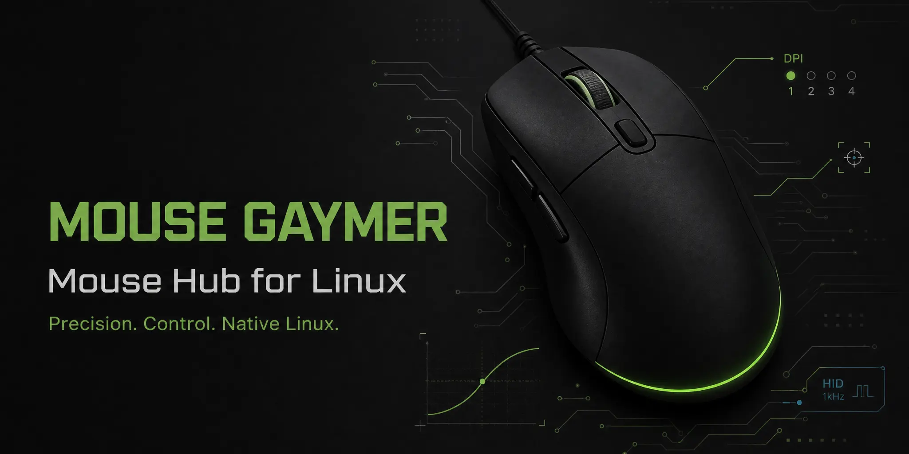

<p align="center">
  
</p>

<h1 align="center">Mouse Hub</h1>

<p align="center">
  Aplicativo desktop nativo para o <strong>Logitech G403 HERO</strong> no Linux Mint.
</p>

<p align="center">
  <a href="https://github.com/Base-Analitica/mouse-hub/actions/workflows/ci.yml"></a>
  
  
  
</p>

## Estado do projeto

O produto principal é a aplicação PyQt5 em `app/`. O foco atual é exclusivamente o Logitech G403 HERO (VID `046d`, PID `c08f`) no Linux Mint; o projeto não tenta ser uma suíte universal de periféricos.

O core já diferencia dispositivo detectado, acesso HID, DPI físico, sensibilidade do sistema e demais capabilities. Operações de hardware só são consideradas bem-sucedidas quando há evidência do protocolo; falha não é convertida em sucesso visual ou persistido.

A suíte automatizada usa fakes/adapters e não substitui validação física. O caminho HID++ de DPI está implementado e testado deterministicamente, mas ainda não deve ser descrito como fisicamente validado no G403 até o teste ser executado no hardware real.

## Capacidades atuais

| Área | Estado | Observação |
| --- | --- | --- |
| **Detecção do G403** | Implementada | Identidade do dispositivo é validada; não depende de `/dev/hidraw0` nem da ordem de enumeração. |
| **DPI físico** | Implementado no software | HID++ com validação de identidade/feature e tratamento separado de timeout, erro de protocolo, permissão e remoção; validação física ainda pendente. |
| **Sensibilidade** | Implementada | É independente do DPI físico. |
| **Perfis e presets** | Implementados | Fonte de verdade no core; aplicação de DPI e sensibilidade ocorre como operações independentes. |
| **Polling rate** | Indisponível no stack atual | A UI não simula sucesso nem marca frequência ativa sem capacidade confirmada. |
| **Auto-clicker** | Funcional, em hardening | 1–50 CPS, três botões e restrição por janela em foco; a consolidação final permanece acompanhada pela issue correspondente. |
| **Macros — persistência/playback** | Implementados | Modelo, armazenamento e reprodução existem no core. |
| **Macros — captura real** | Ainda incompleta | A gravação real de teclado/mouse no app nativo ainda é trabalho pendente; não é apresentada aqui como feature concluída. |

## Requisitos

- Linux, com foco em Linux Mint;
- sessão X11 para as integrações nativas atuais de input/foco;
- Python 3.10+;
- PyQt5 5.15+;
- `python-xlib`.

As dependências Python estão declaradas em [`pyproject.toml`](pyproject.toml).

## Instalação para desenvolvimento/uso a partir do repositório

Use um ambiente virtual; o aplicativo não precisa alterar os pacotes Python do sistema:

```bash
git clone https://github.com/Base-Analitica/mouse-hub.git
cd mouse-hub
python3 -m venv .venv
source .venv/bin/activate
python3 -m pip install -e .
```

Execute diretamente o aplicativo nativo:

```bash
python3 app/mouse_hub_app.py
```

Os launchers legados ainda existentes no repositório estão sendo eliminados/ajustados durante a consolidação do produto nativo. O fluxo suportado não depende de servidor HTTP.

## Dados e configuração

O core usa diretórios XDG:

- configuração: `${XDG_CONFIG_HOME:-~/.config}/mouse-hub/`;
- dados: `${XDG_DATA_HOME:-~/.local/share}/mouse-hub/`.

Existe migração não destrutiva do layout legado em `~/mouse-hub/`. Configuração existente porém ilegível/corrompida não deve ser sobrescrita silenciosamente.

## Permissão HID do G403 HERO

A regra versionada em [`docs/udev/99-logitech-g403-hidraw.rules`](docs/udev/99-logitech-g403-hidraw.rules) concede acesso ao grupo `plugdev` com `MODE="0660"`, sem abrir o dispositivo para todos os usuários.

```bash
sudo cp docs/udev/99-logitech-g403-hidraw.rules /etc/udev/rules.d/
sudo udevadm control --reload-rules
sudo udevadm trigger --action=add --subsystem-match=hidraw
sudo usermod -aG plugdev "$USER"
```

Depois de adicionar o usuário ao grupo, encerre e inicie a sessão novamente. Não use `chmod 666` em `/dev/hidrawX` como fluxo normal.

A descoberta do endpoint é feita pelo aplicativo; não escolha manualmente `/dev/hidraw0`.

## Arquitetura

| Caminho | Responsabilidade |
| --- | --- |
| [`app/`](app/) | UI desktop PyQt5 e composição das páginas. |
| [`mouse_hub/core/`](mouse_hub/core/) | Estado, DPI, sensibilidade, perfis, configuração e automações. |
| [`mouse_hub/platform/`](mouse_hub/platform/) | HID++ e integrações de plataforma. |
| [`tests/`](tests/) | Regressões determinísticas, fakes, benchmarks e smoke da UI. |
| [`docs/`](docs/) | Documentação técnica, regras udev e metodologia de performance. |

A UI projeta o estado do core; não é fonte de verdade sobre o hardware.

## Performance

O hardware de referência do projeto é um Lenovo IdeaPad S145, Intel Core i5, 8 GB RAM, Linux Mint. As metas iniciais incluem CPU idle próxima de zero (alvo ≤ 1% de um núcleo), RSS ≤ 150 MB, nenhum busy-wait e nenhum subprocesso recorrente em idle.

Resultados obtidos em outras máquinas devem ser identificados como medições daquele ambiente e não como resultados do S145. A metodologia reproduzível fica em [`docs/performance/metodologia.md`](docs/performance/metodologia.md).

**Resumo das medições reexecutadas no head final da PR #19** (Linux Mint 22.3, Python 3.12.3, PyQt5 5.15.11, `QT_QPA_PLATFORM=offscreen`, máquina do executor — Intel i5-1235U / 32 GB RAM). O CI executa os mesmos métodos em cada push à branch da PR. Cada número foi obtido nesse ambiente — **não** é resultado no IdeaPad S145; a validação no notebook de referência é descrita na metodologia e só é afirmada após medição física nele:

| Métrica | Medido (head final, máquina do executor) |
| --- | --- |
| Construção da janela (processo já iniciado) | ~97–648 ms (3 execuções; a maior inclui o 1º import do PyQt5) |
| RSS idle | ~60,6 MB (3 execuções) |
| Threads / subprocessos em idle | 1 / 0 |
| CPU idle (10 s) | 0,1–0,5% |
| Auto-clicker 1–50 CPS | 1 CPS → 0,0–0,4%; 20 → 0,4–0,6%; 50 → 0,4–1,0% (emissor fake) |
| Macro playback (10 s) | 0,0–0,1% CPU adicional — regressão #23 (busy-loop) não reapareceu |
| Memória em 120 s | 0,2% de crescimento (62.248 → 62.372 KB) |
| Cold startup — processo Python novo + imports + QApplication + show + event loop | 636–2.085 ms (4 execuções; 3 de 4 entre 636–940 ms, a mais lenta é o 1º import do PyQt5) |
| Macro recording (eventos sintéticos) | 1,3–6,9 µs/callback; bytes/evento constante → O(n) |

O cold startup acima é um **process startup** controlado: novo processo Python com as dependências já instaladas e o código/bytecode já em cache. Ele **não representa** primeira instalação, filesystem frio ou boot completo do sistema — medições nessas condições só valem feitas nelas.

Repetir as medições:

```bash
QT_QPA_PLATFORM=offscreen python3 -m unittest \
  tests.bench_perf tests.bench_cold_startup tests.test_memory_stability \
  tests.test_playback_cost tests.bench_recording -v
```

A regressão conhecida de busy-loop do scheduler possui teste dedicado e não deve ser mascarada por thresholds enfraquecidos.

## Testes

O CI executa sintaxe/imports, suíte determinística, benchmark mínimo, benchmarks complementares e smoke da UI:

```bash
python3 -m compileall -q mouse_hub tests mouse_hub.py app
python3 -c "import mouse_hub.core, mouse_hub.platform.linux"
QT_QPA_PLATFORM=offscreen python3 -m pytest tests/
QT_QPA_PLATFORM=offscreen BENCH_IDLE_SECONDS=10 BENCH_ACTIVE_SECONDS=5 \
  python3 -m unittest tests.bench_perf -v
QT_QPA_PLATFORM=offscreen python3 -m unittest \
  tests.bench_cold_startup tests.bench_recording -v
QT_QPA_PLATFORM=offscreen xvfb-run -a \
  python3 -m unittest tests.smoke_ui_init
```

Testes com fakes provam comportamento do software; não são evidência de validação física do G403.

## Contribuição

Leia [`AGENTS.md`](AGENTS.md) antes de alterar o projeto. Mudanças devem preservar, nesta ordem: correção de hardware, segurança, comportamento verificável, simplicidade e performance.
